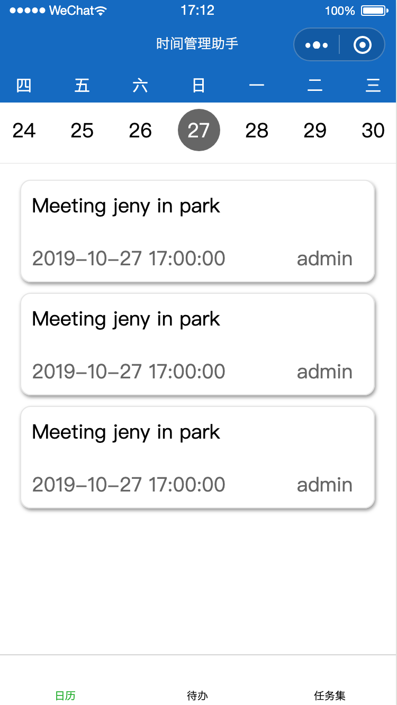

# 微信小程序日历组件

> 实现效果：
>
> 1. 默认展示当前月的所有日期
> 2. 展示每个日期对应是星期几
> 3. 支持左右滑动，点击数字切换到对应日期
> 4. 点击天数刷新列表



## 1. WXML页面展示

```html
<!--index.wxml-->
<view class="container">

  <view class="calendar">
  <!-- scroll-left="{{(defaultIndex - 3) * 53}} 说明：让所选日期居中展示，55是每个日期的宽度，rpx会有误差，调整为53 -->
    <scroll-view class="categories" scroll-x="true" scroll-left="{{(defaultIndex - 3) * 53}}" scroll-with-animation="true">
        <view class="category" wx:for="{{dateList}}" wx:for-item="item" wx:key="index" bindtap="clickCanlendar" data-item="{{item}}">
          <view class="calendar-day">{{dayList[index]}}</view>
          <view class="calendar-date {{defaultIndex==index?'active':''}}">{{item + 1}}</view>
        </view>
    </scroll-view>
  </view>

  <view class="list">
    <scroll-view class="calendar-list" scroll-y="true">
      <view class="list-item" wx:for="{{dataList}}" wx:for-item="item" wx:key="index" bindtap="clickList">
        <view class="list-item-text">{{item.content}}</view>
        <view class="list-item-sub">
          <view class="list-item-time">{{item.endtime}}</view>
          <view class="list-item-address">{{item.createusername}}</view>
        </view>
      </view>
    </scroll-view>
  </view> 
  
</view>

```

## 2.XSS样式

```css
/**index.wxss**/
.categories {
  height: 180rpx;
  border-bottom: 1px solid #eee;
  white-space: nowrap;
  display: flex;
}

::-webkit-scrollbar {
  width: 0;
  height: 0;
  color: transparent;
}

.categories .category {
  text-align: center;
  display: inline-block;
  width: 110rpx;
}

.categories .calendar-date.active {
  background-color: #666;
  color: #fff;
  border-radius: 50%;
}


.categories .category:last-child{
  border: 0
}

.calendar-date {
  width: 40px;
  height: 40px;
  line-height: 40px;
  margin: 12rpx auto;
}

.calendar-day {
  background: #126ac6;
  color: #fff;
  font-size: 30rpx;
  padding: 12rpx 0;
}

.calendar-list {
  height: 1220rpx;
}

.list {
  padding: 30rpx;
  overflow: visible;
}

.list-item {
  height: 150rpx;
  margin: 0 10rpx 20rpx 10rpx;
  padding: 20rpx;
  border: 1px solid #e5e5e5;
  box-shadow: #999 1px 2px 3px;
  border-radius: 20rpx;
}

.list-item-text {
  height: 100rpx;
  overflow: hidden;
  text-overflow: ellipsis;
}

.list-item-sub {
  color: #666;
  display: flex;
}

.list-item-time,
list-item-address {
  width: 80%;
}
```

## 3. JS逻辑实现

计算当前月的总天数

```js
let newDate = new Date();
let year = newDate.getFullYear();
let month = newDate.getMonth();
// 计算出当前月最后一天的日期
let endDate = new Date(year, month, 0).getDate();

this.setData({
  dateList: endDate
});

```

计算每一天是星期几

```js
let newDate = new Date();
let year = newDate.getFullYear();
let month = newDate.getMonth();
let endDate = new Date(year, month, 0).getDate();
// 获取当月第一天是周几
let day = this.getWeek(year, month + 1);
let list = [];
// 可以选择使用中文还是英文，视业务需求而定
// let weekNameList = ['SUN', 'MON', 'TUE', 'WED', 'THU', 'FRI', 'SAT'];
let weekNameList = ['日', '一', '二', '三', '四', '五', '六'];

console.log(day);
// 通过取余%可以计算出当月第一天之后每天是周几
for (let i = 0; i < endDate; i++) {
  list.push(weekNameList[(day + i) % 7]);
}

this.setData({
  dateList: endDate,
  defaultIndex: newDate.getDate() - 1,
  dayList: list,
});
```

获取当月第一天是周几的方法

```js
getWeek: function (year, month) {
  //1.根据年度和月份，创建日期
  //应该先对year,month进行整数及范围校验的。
  var d = new Date();
  d.setYear(year);
  d.setMonth(month - 1);
  d.setDate(1);
  console.log(d);
  //获得周几
  return d.getDay();
}
```

## 4. 完整JS代码

```js
// index.js
//获取应用实例
const app = getApp()

Page({

  /**
   * 页面的初始数据
   */
  data: {
    dataList: [],
    dateList: [],
    dayList: [],
    defaultIndex: 0
  },

  /**
   * 生命周期函数--监听页面加载
   */
  onLoad: function (options) {
    let newDate = new Date();
    let year = newDate.getFullYear();
    let month = newDate.getMonth();
    let endDate = new Date(year, month, 0).getDate();
    let day = this.getWeek(year, month + 1);
    let list = [];
    // let weekNameList = ['SUN', 'MON', 'TUE', 'WED', 'THU', 'FRI', 'SAT'];
    let weekNameList = ['日', '一', '二', '三', '四', '五', '六'];

    console.log(day);

    for (let i = 0; i < endDate; i++) {
      list.push(weekNameList[(day + i) % 7]);
    }

    this.setData({
      dateList: endDate,
      defaultIndex: newDate.getDate() - 1,
      dayList: list,
    });
    // 根据日期获取列表数据
    this.getTaskList(newDate.getDate());

  },

  /**
   * 生命周期函数--监听页面初次渲染完成
   */
  onReady: function () {

  },

  /**
   * 生命周期函数--监听页面显示
   */
  onShow: function () {

  },

  /**
   * 生命周期函数--监听页面隐藏
   */
  onHide: function () {

  },

  /**
   * 生命周期函数--监听页面卸载
   */
  onUnload: function () {

  },

  /**
   * 页面相关事件处理函数--监听用户下拉动作
   */
  onPullDownRefresh: function () {

  },

  /**
   * 页面上拉触底事件的处理函数
   */
  onReachBottom: function () {

  },

  /**
   * 用户点击右上角分享
   */
  onShareAppMessage: function () {

  },

  getTaskList: function(date) {
    let that = this;
    let year = (new Date()).getFullYear();
    let month = (new Date()).getMonth();

    if (date < 10) {
      date = '0' + date;
    }

    // if (month < 10) {
    //   month = '0' + month;
    // }

    let resultList = [];

    for(let i = 0; i < 3; i++) {
      resultList.push({
        content: 'Meeting jeny in park',
        endtime: '2019-10-27 17:00:00',
        createusername: 'admin'
      });
    }

    that.setData({
      dataList: resultList
    });

  },

  /*
   * 获取周几
   */
  getWeek: function (year, month) {
    //1.根据年度和月份，创建日期
    //应该先对year,month进行整数及范围校验的。
    var d = new Date();
    d.setYear(year);
    d.setMonth(month - 1);
    d.setDate(1);
    console.log(d);
    //获得周几
    return d.getDay();
  },

  /**
   * 点击日历切换列表
   */
  clickCanlendar: function (e) {
    // 1.切换日历
    console.log(e.currentTarget.dataset['item']);
    this.setData({
      defaultIndex: e.currentTarget.dataset['item']
    });
    // 2.根据日历请求数据
    this.getTaskList(e.currentTarget.dataset['item'] + 1);
  },

  /**
   * 点击日历切换列表
   */
  clickList: function (e) {
    wx.navigateTo({
      url: '/pages/taskDetail/taskDetail?id=1',
      events: {
        // 为指定事件添加一个监听器，获取被打开页面传送到当前页面的数据
        acceptDataFromOpenedPage: function (data) {
          console.log(data)
        },
        someEvent: function (data) {
          console.log(data)
        }
    },
      success: function (res) {
        // 通过eventChannel向被打开页面传送数据
        // res.eventChannel.emit('acceptDataFromOpenerPage', { data: 'test' })
      }
    })
  },
})
```

