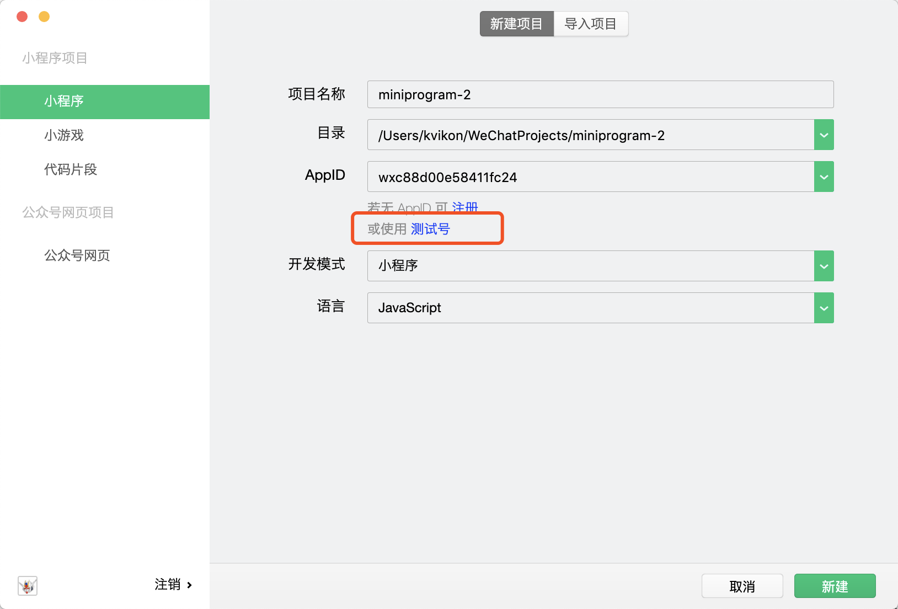
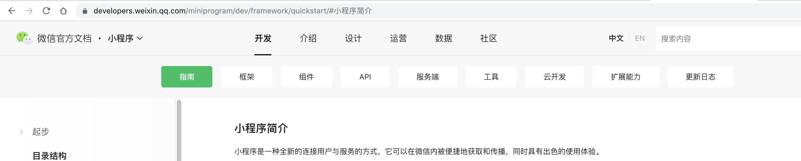
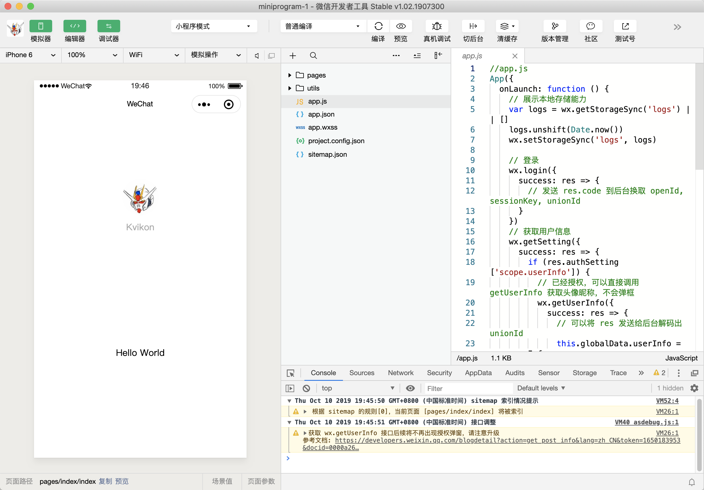
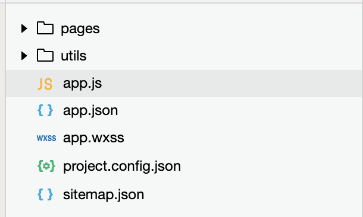
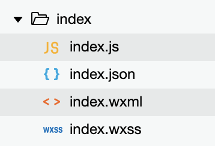
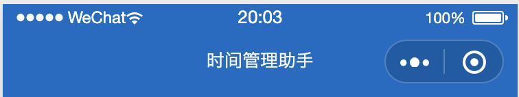
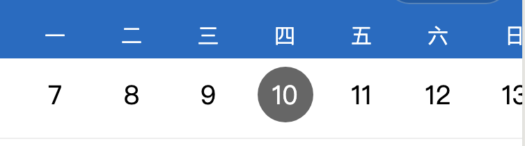
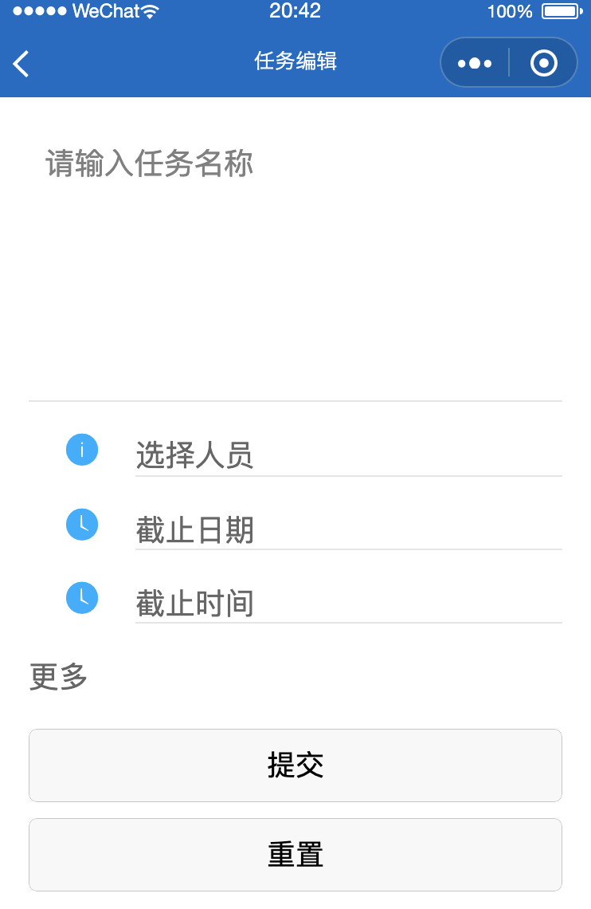
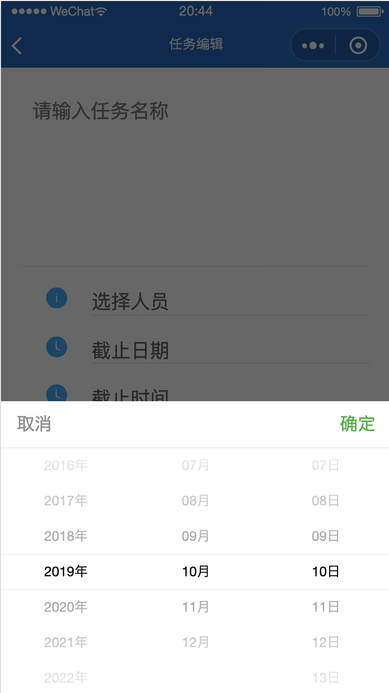
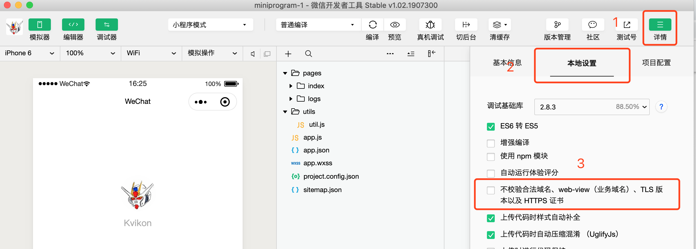

# 微信小程序（测试号）开发快速入门

> 本教程的目的是快速实现前后端通讯，作为快速查阅手册，可以快速定位到官网页面。
>
> 官方解释：小程序是一种全新的连接用户与服务的方式，它可以在微信内被便捷地获取和传播，同时具有出色的使用体验。
>
> 本教程只针对测试号进行快速讲解，如果需要正式账号开发，请移步官方教程。
>
> 


## 1. 官方教程

> 建议频繁查阅官方教程：https://developers.weixin.qq.com/miniprogram/dev/framework/ ，上面有所有小程序开发说明




## 2. 开发工具

> 微信小程序有自己的开发工具，下载地址：https://developers.weixin.qq.com/miniprogram/dev/devtools/download.html ，本质是一个Chrome V8内核的浏览器。




## 3. 小程序代码构成

> 官网地址：https://developers.weixin.qq.com/miniprogram/dev/framework/quickstart/code.html

1. `.json` 后缀的 `JSON` 配置文件
   * JSON格式配置
2. `.wxml` 后缀的 `WXML` 模板文件
   * 封装了丰富的小程序标签，例如view`, `button`, `text
   * `增加了wx:if` 这样的属性以及 {{ }} 这样的表达式（数据双向绑定）
3. `.wxss` 后缀的 `WXSS` 样式文件
   * 支持新的尺寸单位 `rpx` ，开发者可以免去换算手机屏幕像素的烦恼，有一些误差
   * 局部页面样式 `page.wxss` 仅对当前页面生效
   * `WXSS` 仅支持部分 `CSS` 选择器
4. `.js` 后缀的 `JS` 脚本逻辑文件
   * 数据双向绑定
   * 页面生命周期管理

## 4. 目录结构

> 学习任何框架，我们一般先会接触到其目录结构
>
> 官网地址：https://developers.weixin.qq.com/miniprogram/dev/framework/structure.html
>
> 

| 文件                                                         | 必需 | 作用             |
| :----------------------------------------------------------- | :--- | :--------------- |
| [app.js](https://developers.weixin.qq.com/miniprogram/dev/framework/app-service/app.html) | 是   | 小程序逻辑       |
| [app.json](https://developers.weixin.qq.com/miniprogram/dev/framework/config.html) | 是   | 小程序公共配置   |
| [app.wxss](https://developers.weixin.qq.com/miniprogram/dev/framework/view/wxss.html) | 否   | 小程序公共样式表 |

**app.js可以调用微信或者第三方app的用户信息接口，获取到用户信息，并保存到本地缓存中**

```js
//app.js
App({
  onLaunch: function () {
    // 展示本地存储能力
    var logs = wx.getStorageSync('logs') || []
    logs.unshift(Date.now())
    wx.setStorageSync('logs', logs)

    // 登录
    wx.login({
      success: res => {
        // 发送 res.code 到后台换取 openId, sessionKey, unionId
      }
    })
    // 获取用户信息
    wx.getSetting({
      success: res => {
        if (res.authSetting['scope.userInfo']) {
          // 已经授权，可以直接调用 getUserInfo 获取头像昵称，不会弹框
          wx.getUserInfo({
            success: res => {
              // 可以将 res 发送给后台解码出 unionId
              this.globalData.userInfo = res.userInfo

              // 由于 getUserInfo 是网络请求，可能会在 Page.onLoad 之后才返回
              // 所以此处加入 callback 以防止这种情况
              if (this.userInfoReadyCallback) {
                this.userInfoReadyCallback(res)
              }
            }
          })
        }
      }
    })
  },
  globalData: {
    userInfo: null
  }
})
```

> 一个小程序页面由四个文件组成，分别是：
>
> 

| 文件类型                                                     | 必需 | 作用       |
| :----------------------------------------------------------- | :--- | :--------- |
| [js](https://developers.weixin.qq.com/miniprogram/dev/framework/app-service/page.html) | 是   | 页面逻辑   |
| [wxml](https://developers.weixin.qq.com/miniprogram/dev/framework/view/wxml/) | 是   | 页面结构   |
| [json](https://developers.weixin.qq.com/miniprogram/dev/framework/config.html#页面配置) | 否   | 页面配置   |
| [wxss](https://developers.weixin.qq.com/miniprogram/dev/framework/view/wxss.html) | 否   | 页面样式表 |


## 5. 全局配置

> 小程序根目录下的 `app.json` 是当前小程序的全局配置，包括了小程序的所有页面路径、界面表现、网络超时时间、底部 tab 等
>
> 官网地址：https://developers.weixin.qq.com/miniprogram/dev/reference/configuration/app.html

```js
{
  "pages": [ // 定义所有页面路径
    "pages/index/index",
    "pages/logs/logs",
    "pages/list/list",
    "pages/taskDetail/taskDetail",
    "pages/taskEdit/taskEdit",
    "pages/selectPerson/selectPerson"
  ],
  "window": { // 定义全局页面抬头样式
    "backgroundTextStyle": "light",	// 下拉 loading 的样式，仅支持 dark / light
    "navigationBarBackgroundColor": "#126ac6", // 导航栏背景颜色，如 #000000
    "navigationBarTitleText": "时间管理助手", // 导航栏标题文字内容
    "navigationBarTextStyle": "white" // 导航栏标题颜色，仅支持 black / white
  },
  "sitemapLocation": "sitemap.json", 
  "tabBar": { // 如果小程序是一个多 tab 应用（客户端窗口的底部或顶部有 tab 栏可以切换页面），可以通过 tabBar 配置项指定 tab 栏的表现，以及 tab 切换时显示的对应页面。
    "list": [
      {
        "pagePath": "pages/index/index",
        "text": "日历"
      },
      {
        "pagePath": "pages/logs/logs",
        "text": "待办"
      },
      {
        "pagePath": "pages/list/list",
        "text": "任务集"
      }
    ]
  }
}
```

功能总结：

* 支持配置所有页面路径，以便微信能正常加载

* 支持配置全局顶部导航栏样式

  

* 支持配置底部菜单栏

  


## 6. 页面配置

> 官网地址：https://developers.weixin.qq.com/miniprogram/dev/reference/configuration/page.html
>
> 以下是部分配置例子：

```js
{
  "navigationBarBackgroundColor": "#ffffff", // 导航栏背景颜色，如 #000000
  "navigationBarTextStyle": "black", // 导航栏标题颜色，仅支持 black / white
  "navigationBarTitleText": "微信接口功能演示", // 导航栏标题文字内容
  "backgroundColor": "#eeeeee", // 窗口的背景色
  "backgroundTextStyle": "light" // 下拉 loading 的样式，仅支持 dark / light
}
```

每一个小程序页面也可以使用 `.json` 文件来对本页面的窗口表现进行配置。页面中配置项在当前页面会覆盖 `app.json` 的 `window` 中相同的配置项。


## 7. 页面组件

> 微信小程序拥有丰富的组件，让开发者可以快速开发出样式美观，功能稳定的小程序，官网地址：https://developers.weixin.qq.com/miniprogram/dev/component/ ，此处挑选几个常用的组件进行讲解

### scroll-view

>  官网地址：https://developers.weixin.qq.com/miniprogram/dev/component/scroll-view.html
>
> 可滚动视图区域。使用竖向滚动时，需要给[scroll-view](https://developers.weixin.qq.com/miniprogram/dev/component/scroll-view.html)一个固定高度，通过 WXSS 设置 height。组件属性的长度单位默认为px，[2.4.0](https://developers.weixin.qq.com/miniprogram/dev/framework/compatibility.html)起支持传入单位(rpx/px)。以下是常用属性，详细属性请到官网查阅。

| 属性        | 类型          | 默认值 | 必填 | 说明               | 最低版本                                                     |
| :---------- | :------------ | :----- | :--- | :----------------- | :----------------------------------------------------------- |
| scroll-x    | boolean       | false  | 否   | 允许横向滚动       | [1.0.0](https://developers.weixin.qq.com/miniprogram/dev/framework/compatibility.html) |
| scroll-y    | boolean       | false  | 否   | 允许纵向滚动       | [1.0.0](https://developers.weixin.qq.com/miniprogram/dev/framework/compatibility.html) |
| scroll-top  | number/string |        | 否   | 设置竖向滚动条位置 | [1.0.0](https://developers.weixin.qq.com/miniprogram/dev/framework/compatibility.html) |
| scroll-left | number/string |        | 否   | 设置横向滚动条位置 | [1.0.0](https://developers.weixin.qq.com/miniprogram/dev/framework/compatibility.html) |



### swiper

> 官网地址：https://developers.weixin.qq.com/miniprogram/dev/component/swiper.html
>
> 滑块视图容器。其中只可放置[swiper-item](https://developers.weixin.qq.com/miniprogram/dev/component/swiper-item.html)组件，否则会导致未定义的行为。以下是常用属性，详细属性请到官网查阅。

| 属性                   | 类型    | 默认值            | 必填 | 说明                 | 最低版本                                                     |
| :--------------------- | :------ | :---------------- | :--- | :------------------- | :----------------------------------------------------------- |
| indicator-dots         | boolean | false             | 否   | 是否显示面板指示点   | [1.0.0](https://developers.weixin.qq.com/miniprogram/dev/framework/compatibility.html) |
| indicator-color        | color   | rgba(0, 0, 0, .3) | 否   | 指示点颜色           | [1.1.0](https://developers.weixin.qq.com/miniprogram/dev/framework/compatibility.html) |
| indicator-active-color | color   | #000000           | 否   | 当前选中的指示点颜色 | [1.1.0](https://developers.weixin.qq.com/miniprogram/dev/framework/compatibility.html) |
| autoplay               | boolean | false             | 否   | 是否自动切换         | [1.0.0](https://developers.weixin.qq.com/miniprogram/dev/framework/compatibility.html) |
| interval               | number  | 5000              | 否   | 自动切换时间间隔     | [1.0.0](https://developers.weixin.qq.com/miniprogram/dev/framework/compatibility.html) |
| duration               | number  | 500               | 否   | 滑动动画时长         | [1.0.0](https://developers.weixin.qq.com/miniprogram/dev/framework/compatibility.html) |


### form表单

> 官网地址： https://developers.weixin.qq.com/miniprogram/dev/component/form.html
>
> 表单。将组件内的用户输入的[switch](https://developers.weixin.qq.com/miniprogram/dev/component/switch.html) [input](https://developers.weixin.qq.com/miniprogram/dev/component/input.html) [checkbox](https://developers.weixin.qq.com/miniprogram/dev/component/checkbox.html) [slider](https://developers.weixin.qq.com/miniprogram/dev/component/slider.html) [radio](https://developers.weixin.qq.com/miniprogram/dev/component/radio.html) [picker](https://developers.weixin.qq.com/miniprogram/dev/component/picker.html) 提交。
>
> 当点击 [form](https://developers.weixin.qq.com/miniprogram/dev/component/form.html) 表单中 form-type 为 submit 的 [button](https://developers.weixin.qq.com/miniprogram/dev/component/button.html) 组件时，会将表单组件中的 value 值进行提交，需要在表单组件中加上 name 来作为 key。

| 属性                  | 类型        | 默认值 | 必填 | 说明                                                         | 最低版本                                                     |
| :-------------------- | :---------- | :----- | :--- | :----------------------------------------------------------- | :----------------------------------------------------------- |
| report-submit         | boolean     | false  | 否   | 是否返回 formId 用于发送[模板消息](https://developers.weixin.qq.com/miniprogram/dev/framework/open-ability/template-message.html) | [1.0.0](https://developers.weixin.qq.com/miniprogram/dev/framework/compatibility.html) |
| report-submit-timeout | number      | 0      | 否   | 等待一段时间（毫秒数）以确认 formId 是否生效。如果未指定这个参数，formId 有很小的概率是无效的（如遇到网络失败的情况）。指定这个参数将可以检测 formId 是否有效，以这个参数的时间作为这项检测的超时时间。如果失败，将返回 requestFormId:fail 开头的 formId | [2.6.2](https://developers.weixin.qq.com/miniprogram/dev/framework/compatibility.html) |
| bindsubmit            | eventhandle |        | 否   | 携带 form 中的数据触发 submit 事件，event.detail = {value : {'name': 'value'} , formId: ''} | [1.0.0](https://developers.weixin.qq.com/miniprogram/dev/framework/compatibility.html) |
| bindreset             | eventhandle |        | 否   | 表单重置时会触发 reset 事件                                  | [1.0.0](https://developers.weixin.qq.com/miniprogram/dev/framework/compatibility.html) |



### picker

> 官网地址：https://developers.weixin.qq.com/miniprogram/dev/component/picker.html
>
> 从底部弹起的滚动选择器。

| 属性       | 类型        | 默认值   | 必填 | 说明           | 最低版本                                                     |
| :--------- | :---------- | :------- | :--- | :------------- | :----------------------------------------------------------- |
| mode       | string      | selector | 否   | 选择器类型     | [1.0.0](https://developers.weixin.qq.com/miniprogram/dev/framework/compatibility.html) |
| disabled   | boolean     | false    | 否   | 是否禁用       | [1.0.0](https://developers.weixin.qq.com/miniprogram/dev/framework/compatibility.html) |
| bindcancel | eventhandle |          | 否   | 取消选择时触发 | [1.9.90](https://developers.weixin.qq.com/miniprogram/dev/framework/compatibility.html) |

**mode 的合法值**

| 值            | 说明         | 最低版本 |
| :------------ | :----------- | :------- |
| selector      | 普通选择器   |          |
| multiSelector | 多列选择器   |          |
| time          | 时间选择器   |          |
| date          | 日期选择器   |          |
| region        | 省市区选择器 |          |



## 8. 页面跳转

> 官网地址：https://developers.weixin.qq.com/miniprogram/dev/framework/app-service/route.html
>
> 在小程序中所有页面的路由全部由框架进行管理。

###wx.navigateTo(Object object)，跳转到非菜单页面

> 官网地址：https://developers.weixin.qq.com/miniprogram/dev/api/route/wx.navigateTo.html
>
> 保留当前页面，跳转到应用内的某个页面。但是不能跳到 tabbar 页面。使用 [wx.navigateBack](https://developers.weixin.qq.com/miniprogram/dev/api/route/wx.navigateBack.html) 可以返回到原页面。小程序中页面栈最多十层

```js
wx.navigateTo({
      url: '/pages/taskDetail/taskDetail?id=1',
      events: {
        // 为指定事件添加一个监听器，获取被打开页面传送到当前页面的数据
        acceptDataFromOpenedPage: function (data) {
          console.log(data)
        },
        someEvent: function (data) {
          console.log(data)
        }
    },
      success: function (res) {
        // 通过eventChannel向被打开页面传送数据
        // res.eventChannel.emit('acceptDataFromOpenerPage', { data: 'test' })
      }
    })
```

###wx.switchTab(Object object)，跳转到菜单页面

> 官网地址：https://developers.weixin.qq.com/miniprogram/dev/api/route/wx.switchTab.html
>
> 跳转到 tabBar 页面，并关闭其他所有非 tabBar 页面

```js
wx.switchTab({
  url: '/index'
})
```


## 9. 数据请求

> 官网地址：https://developers.weixin.qq.com/miniprogram/dev/api/network/request/wx.request.html
>
> 发起 HTTPS 网络请求。使用前请注意阅读[相关说明](https://developers.weixin.qq.com/miniprogram/dev/framework/ability/network.html)。

```js
wx.request({
  url: 'http://localhost:8090/DOMSM/RequestAction_request.do', // 跨域请求web后端，web后端需要在过滤器中设置允许跨域
  method: "POST",
  data: {
    "params": JSON.stringify({
      "head": {},
      "username": 'admin', // 用户信息一般在app.js中调用微信用户信息接口，或者第三方app，如凡泰等获取
      "userid": 'admin', // 用户信息一般在app.js中调用微信用户信息接口，或者第三方app，如凡泰等获取
      "data": {
        // 只加载当月的数据
        startdate: year + '-' + month + '-' + date + ' 00:00',
        enddate: year + '-' + month + '-' + date + ' 23:59'
      }})
  },
  header: {
    'content-type': 'application/x-www-form-urlencoded' // 注意此处不可以用application/json，否则web后端会拿不到参数
  },
  success(res) {
    console.log(res.data);

    if (res.data && res.data.content && res.data.content.result && res.data.content.result.data && res.data.content.result.data.result) {
      let resultList = res.data.content.result.data.result;
      console.log(resultList);

      that.setData({
        dataList: resultList
      });

    }
  }
})
```

web后端需要在过滤器中设置允许跨域，代码如下：

```java
@Override
public void doFilter(ServletRequest req, ServletResponse res, FilterChain chain) throws IOException, ServletException {
  HttpServletResponse response = (HttpServletResponse) res;
  response.addHeader("Access-Control-Allow-Origin", "*");
  response.addHeader("Access-Control-Allow-Credentials", "true");
  response.addHeader("Access-Control-Allow-Methods", "POST, GET, OPTIONS, DELETE, PUT, HEAD");
  response.addHeader("Access-Control-Allow-Headers", "Content-Type");
  response.addHeader("Access-Control-Max-Age", "3600");

  chain.doFilter(req, response);
}
```

需要注意的是，微信小程序开发工具默认是禁止本地和未授权url的，需要在小工具中设置不校验合法域名，如下：



设置不校验合法域名之后，在手机上测试的时候，如果请求的数据接口url是本地或者内网的话，是无法获取数据的。即设置不校验合法域名在手机上是无效的，只能在开发工具中使用。

## 10. 总结

本教程可以帮助新手快速创建能实现前后端通讯的入门项目，正如本文开头所属，本教程目的是作为快速查阅手册，可以快速定位到官网页面，相当于官网的部分教程指引辅助手册。还有很多微信原生功能，如获取微信支付、摄像头等，可以参考官网教程：

* 指南：https://developers.weixin.qq.com/miniprogram/dev/framework/
* 框架：https://developers.weixin.qq.com/miniprogram/dev/reference/
* 组件：https://developers.weixin.qq.com/miniprogram/dev/component/
* API： https://developers.weixin.qq.com/miniprogram/dev/api/
* 服务端：https://developers.weixin.qq.com/miniprogram/dev/api-backend/
* 工具：https://developers.weixin.qq.com/miniprogram/dev/devtools/devtools.html
* 云开发：https://developers.weixin.qq.com/miniprogram/dev/wxcloud/basis/getting-started.html
* 扩展能力：https://developers.weixin.qq.com/miniprogram/dev/extended/weui/
* 更新日志：https://developers.weixin.qq.com/miniprogram/dev/framework/release/